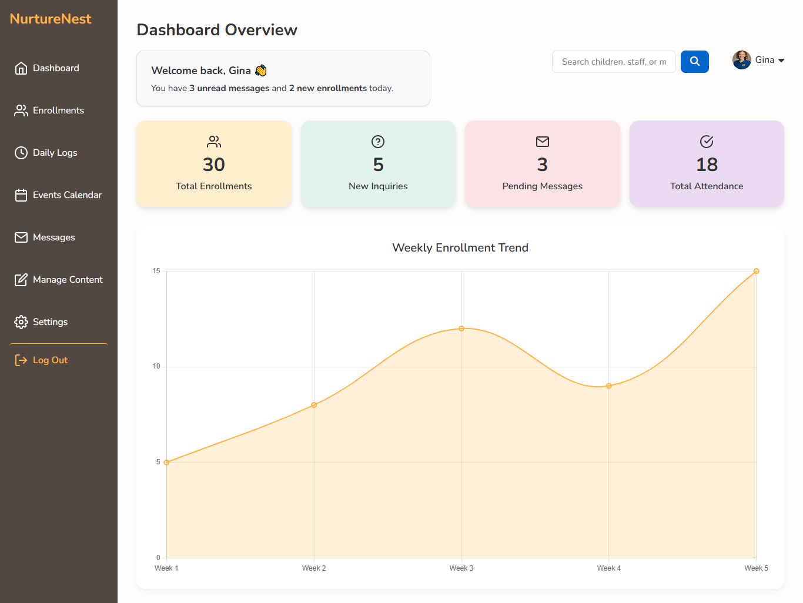

# NurtureNest Admin Dashboard Prototype

A prototype admin dashboard for NurtureNest, built to help staff manage enrollments, daily logs, and content updates. Modeled on real-world workflows, it emphasizes usability and efficiency, with mock API integration and data visualizations powered by Chart.js.

## 🌐 Live Demo:

[View the live dashboard prototype](https://nurturenestcare-admin-dashboard.vercel.app) (Desktop View Only)

## 📸 Screenshots:

### NurtureNest Admin dashboard prototype

## ✅ Features:

- Sidebar with key sections (Dashboard overview, Enrollments, Daily logs, Messages, Settings)  
- Events calendar loading mock events from JSON  
- Stat cards with dynamic data for enrollments, inquiries, messages, and attendance
- Line chart (Chart.js) showing weekly enrollment trends  
- Forms for updating content (e.g., homepage text, FAQs, activities highlight)

## 🤝 Contributing:

This is a personal concept project built for learning and portfolio development.  
If you’d like to share feedback, ideas, or ask questions, feel free to explore the [CONTRIBUTING.md](CONTRIBUTING.md) file for details.

## 📄 License:

Shared for educational and portfolio purposes. If you reuse any part of the design or code, please credit the original author.

## 👤 Author:

**Chijioke Nwabasili**
- Portfolio: [chijiokenwabasili.vercel.app](https://chijiokenwabasili.vercel.app)
- LinkedIn: [Chijioke Nwabasili](https://linkedin.com/in/chijioke-nwabasili)
